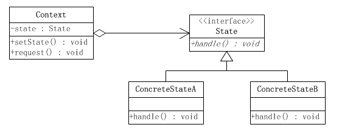

## 有限状态机 和 状态模式

> **有限状态机**

有限状态机（Finite-state machine，FSM），又称有限状态自动机，简称状态机，是表示有限个状态以及在这些状态之间的转移
和动作等行为的一个数学模型。

状态机可归纳为4个要素：现态、条件、动作、次态。

- **现态**：指当前流程所处的状态，包括起始、中间、终结状态。

- **条件**：也可称为事件；当一个条件被满足时，将会触发一个动作并执行一次状态的迁移。

- **动作**：当条件满足后要执行的动作。动作执行完毕后，可以迁移到新的状态，也可以仍旧保持原状态。

- **次态**：当条件满足后要迁往的状态。“次态”是相对于“现态”而言的，“次态”一旦被激活，就转变成新的“现态”了。

使用建议：

1.每个动作执行前，必须检查当前状态和触发动作状态的一致性；

2.状态机的状态更改，只能通过动作进行，其它操作都是不符合规范的；

3.需要添加分布式锁保证动作的原子性，添加数据库事务保证数据的一致性；

4.类似的动作（比如操作用户、请求参数、动作含义等）可以合并为一个动作，并根据动作执行结果转向不同的状态。

> **状态模式**

状态模式把所研究的对象的行为包装在不同的状态对象里，每一个状态对象都属于一个抽象状态类的一个子类。状态模式的意图是
让一个对象在其内部状态改变的时候，其行为也随之改变。状态模式的示意性类图如下所示：

状态模式所涉及到的角色有：

- **环境(Context)角色**，也成上下文：定义客户端所感兴趣的接口，并且保留一个具体状态类的实例。这个具体状态类的实例给出此环境对象的现有状态。

- **抽象状态(State)角色**：定义一个接口，用以封装环境（Context）对象的一个特定的状态所对应的行为。

- **具体状态(ConcreteState)角色**：每一个具体状态类都实现了环境（Context）的一个状态所对应的行为。

