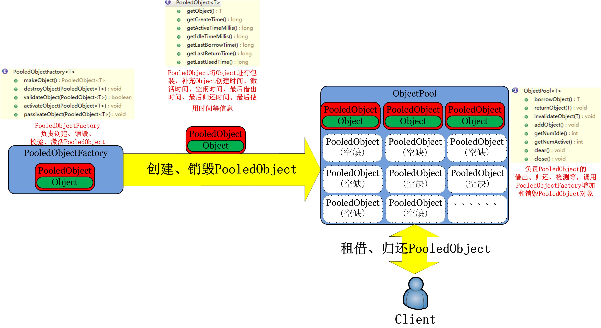

## Apache commons-pool2 

### 对象的池化技术

 Apache commons-pool2类库是对象池技术的一种具体实现，它的出现是为了解决频繁的创建和销毁对象带来的性能损耗问题，原理就是建立一个
对象池，池中预先生成了一些对象，需要对象的时候进行租借，用完后进行归还，对象不够时灵活的自动创建，对象池满后提供参数控制是否阻塞还
是非阻塞响应租借.

并非所有对象都可以用来池化，因为维护池也需要开销，对生成时开销不大的对象进行池化，它可能降低性能。对于没有状态的对象 String，在重
复使用之前，无需进行任何处理；对于有状态的对象如StringBuffer，在重复使用之前，需要恢复到同等于生成的状态，如果恢复不了的话，就只
能丢掉，改用创建的实例了。

### Apache commons-pool2中3类重要接口

- **PooledObjectFactory/KeyedPooledObjectFactory**：是两个接口，作用都是产生PooledObject的工厂，定义了如何makeObject创建、
destroyObject销毁、validateObject校验、activateObject激活PooledObject对象，

- **ObjectPool/KeyedObjectPool**：用于管理要被池化的对象的借出和归还，并通知PoolableObjectFactory完成相应的工作；他们分别
针对普通的pool和以名值对映射的pool。Apache commons-pool2默认提供了的5个实现（SoftReferenceObjectPool、GenericObjectPool、
ProxiedObjectPool、GenericKeyedObjectPool、ProxiedKeyedObjectPool)

- **PooledObject**：这是commons-pools里比较有意思的一个类族。是对需要放到池里对象的一个包装类。添加了一些附加的信息，比如说
状态信息，创建时间，激活时间，关闭时间等。这些添加的信息方便pool来管理和实现一些特定的操作。

- **PooledObjectFactory PooledObject ObjectPool关系和作用**

- **KeyedPooledObjectFactory PooledObject KeyedObjectPool关系和作用**

### Apache commons-pool2使用的基本步骤

- 步骤一：实现自己的PooledObjectFactory
- 步骤二：创建ObjectPool对象
- 步骤三：从ObjectPool获取到PooledObject对象，进行相关业务操作

### 常见配置

通用的配置都在GenericObjectPoolConfig类中：

- **maxTotal**：对象池中最多允许的对象数，默认8（可能超过，不过超过后使用完了就会销毁，后面源码会介绍相关机制）
- **maxIdle**：对象池中最多允许存在的空闲对象，默认8
- **minIdle**：池中最少要保留的对象数，默认0
- **lifo**：是否使用FIFO先进先出的模式获取对象（空闲对象都在一个队列中），默认为true使用先进先出，false是先进后出
- **fairness**：是否使用公平锁，默认false(公平锁是线程安全中的概念，true的含义是谁先等待获取锁，随先在锁释放的时候获取锁，如非必要，
一般不使用公平锁，会影响性能)
- **maxWaitMillis**：从池中获取一个对象最长的等待时间，默认-1，含义是无限等，超过这个时间还未获取空闲对象，就会抛出异常。
- **minEvictableIdleTimeMillis**：最小的驱逐时间，单位毫秒，默认30分钟。这个用于驱逐线程，对象空闲时间超过这个时间，意味着此时系
统不忙碌，会减少对象数量。
- **evictorShutdownTimeoutMillis**：驱逐线程关闭的超时时间，默认10秒。
- **softMinEvictableIdleTimeMillis**：也是最小的驱逐时间，但是会和另一个指标minIdle一同使用，满足空闲时间超过这个设置，且当前空
闲数量比设置的minIdle要大，会销毁该对象。所以，通常该值设置的比minEvictableIdleTimeMillis要小。
- **numTestsPerEvictionRun**：驱逐线程运行每次测试的对象数量，默认3个。驱逐线程就是用来检查对象空闲状态，通过设置的对象数量等参数，
保持对象的活跃度和数量，其是一个定时任务，每次不是检查所有的对象，而是抽查几个，这个就是用于抽查。
- **evictionPolicyClassName**：驱逐线程使用的策略类名，之前的minEvictableIdleTimeMillis和softMinEvictableIdleTimeMillis就
是默认策略DefaultEvictionPolicy的实现，可以自己实现策略。
- **testOnCreate**：在创建对象的时候是否检测对象，默认false。后续会结合代码说明是如何检测的。
- **testOnBorrow**：在获取空闲对象的时候是否检测对象是否有效，默认false。这个通常会设置成true，一般希望获取一个可用有效的对象吧。
- **testOnReturn**：在使用完对象放回池中时是否检测对象是否仍有效，默认false。
- **testWhileIdle**：在空闲的时候是否检测对象是否有效，这个发生在驱逐线程执行时。
- **timeBetweenEvictionRunsMillis**：驱逐线程的执行周期，上面说过该线程是个定时任务。默认-1，即不开启驱逐线程，所以与之相关的参
数是没有作用的。
- **blockWhenExhausted**：在对象池耗尽时是否阻塞，默认true。false的话超时就没有作用了。
- **jmxEnabled**：是否允许jmx的方式创建一个配置实例，默认true。
- **jmxNamePrefix**：jmx默认的前缀名，默认为pool
- **jmxNameBase**：jmx默认的base name，默认为null，意味着池提供一个名称。

